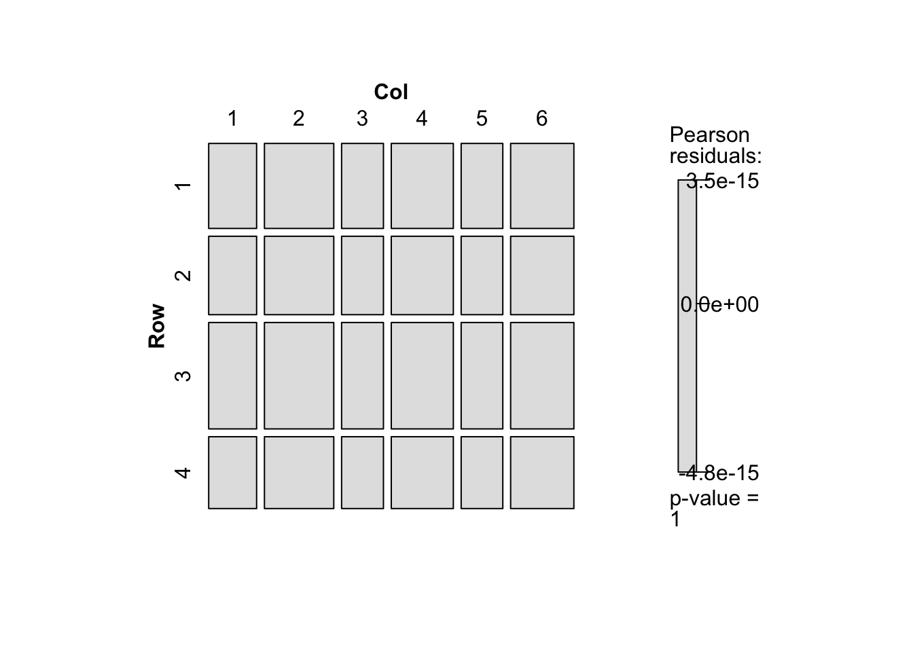

# 補足のノート {-}


## パッケージ

```r
library(tidyverse)
library(magrittr)
library(gnm)
library(vcd)
```


## クロス表の作成


```r
Freq <- c( 64,  94, 58, 46, 
           57,  94, 54, 40,
           57, 105, 65, 60,
           72, 141, 77, 94,
           36,  97, 54, 78,
           21,  71, 54, 71)
# byrow = TRUEとすることを忘れずに．
tab <- matrix(Freq, nrow = 6, ncol = 4, byrow = TRUE) %>% as.table()
dimnames(tab)
```

```
[[1]]
[1] "A" "B" "C" "D" "E" "F"

[[2]]
[1] "A" "B" "C" "D"
```

```r
dimnames(tab) <- list(SES = LETTERS[1:6],
                      MHS = c("well", "mild", "modelrate", "impared"))
tab
```

```
   MHS
SES well mild modelrate impared
  A   64   94        58      46
  B   57   94        54      40
  C   57  105        65      60
  D   72  141        77      94
  E   36   97        54      78
  F   21   71        54      71
```


## 集計データの作成
- 表のデータではなく，各変数の組み合わせとその度数からなるデータを作成する．
- 度数はまず1行目について数値を並べ（1行1列から1行$I$列まで），次に2行目について数値を並べる（2行1列から2行$I$列まで）．これを`Freq`とする．
- 例として「編者による序文」の親の職業と精神的健康の例で考えてみる．これは$6\times4$のクロス表なので，まず1行1列から1行4列までの数字を入力し，次に2行1列から2行4列まで入力する．これを3行目から6行目まで繰り返す．表との対応を考えて適当な改行をいれるのもよい．ただしRは改行を入れても入れなくても，単に数値の列（ベクトル）として扱う．

- `gl`によって変数を作成する．度数がどの行と列に対応しているのかに注意してほしい．


```r
# 1行1列から1行4列，・・・・，6行1列から6行4列まで順に入力
Freq <- c( 64, 94, 58, 46, 57, 94, 54, 40, 57, 105, 65, 60, 72, 141, 77, 94, 36,  97, 54, 78, 21, 71, 54, 71)

# 表ようにして入力
Freq <- c( 64,  94, 58, 46, 
           57,  94, 54, 40,
           57, 105, 65, 60,
           72, 141, 77, 94,
           36,  97, 54, 78,
           21,  71, 54, 71)
```

- 行カテゴリと列カテゴリの数は$I$や$J$となっている．
- `I`を使いたいが，Rの関数にすでに用意されているので別の名前を考える．ここでは`NI`と`NJ`とする．
- 例のデータでは，行カテゴリ数$I = 4$，列カテゴリ数$J = 5$である．


```r
NI <- 4
NJ <- 6
```


- では，`Freq`に対応する行カテゴリと列カテゴリを並べてみる．先程の入力のルールにしたがうと，行については1行1列から1行4列までの数字を入力しているので`1,1,1,1`となり，次に`2,2,2,2`となる．これを繰り返し最後は`6,6,6,6`となる．列については，`1,2,3,4`が6回繰り返される．


```r
Row <- c(1,1,1,1,2,2,2,2,3,3,3,3,4,4,4,4,5,5,5,5,6,6,6,6)
Col <- c(1,2,3,4,1,2,3,4,1,2,3,4,1,2,3,4,1,2,3,4,1,2,3,4)
class(Row)
```

```
[1] "numeric"
```

```r
class(Col)
```

```
[1] "numeric"
```

- 属性が数値になっているので`as.factor`（または`factor`）で因子（factor）に変換する．


```r
Row <- as.factor(Row)
Col <- as.factor(Col)
class(Row);class(Col)
```

```
[1] "factor"
```

```
[1] "factor"
```

```r
Row
```

```
 [1] 1 1 1 1 2 2 2 2 3 3 3 3 4 4 4 4 5 5 5 5 6 6 6 6
Levels: 1 2 3 4 5 6
```

```r
Col
```

```
 [1] 1 2 3 4 1 2 3 4 1 2 3 4 1 2 3 4 1 2 3 4 1 2 3 4
Levels: 1 2 3 4
```

- 単純な数値の列を作成したければ`rep`関数が便利である．これは整数（integer）となる．


```r
Row <- rep(1:4, each = 5)
Col <- rep(1:5, length.out = 20)
class(Row)
```

```
[1] "integer"
```

```r
class(Col)
```

```
[1] "integer"
```

```r
Row <- as.factor(Row)
Col <- as.factor(Col)
class(Row)
```

```
[1] "factor"
```

```r
class(Col)
```

```
[1] "factor"
```

```r
Row
```

```
 [1] 1 1 1 1 1 2 2 2 2 2 3 3 3 3 3 4 4 4 4 4
Levels: 1 2 3 4
```

```r
Col
```

```
 [1] 1 2 3 4 5 1 2 3 4 5 1 2 3 4 5 1 2 3 4 5
Levels: 1 2 3 4 5
```

- `gl`はGenerate Factor Levelsという関数で，`rep`に似ているが，数値ではなく因子を結果として出力する．
- 1から`n`までの数字をぞれぞれ`k`回繰り返して出力する．


```r
Row <- gl(n = 6, k = 4)
Col <- gl(n = 4, k = 1, length = 24)
class(Row)
```

```
[1] "factor"
```

```r
class(Col)
```

```
[1] "factor"
```

```r
Row
```

```
 [1] 1 1 1 1 2 2 2 2 3 3 3 3 4 4 4 4 5 5 5 5 6 6 6 6
Levels: 1 2 3 4 5 6
```

```r
Col
```

```
 [1] 1 2 3 4 1 2 3 4 1 2 3 4 1 2 3 4 1 2 3 4 1 2 3 4
Levels: 1 2 3 4
```

- 以上より，`Freq`，`Row`，`Col`の3つの変数が作成された．これらからなるデータを作成する．`data.frame`と`tibble`のどちらでもよいが，
`tibble`の場合は表示させた後に，データの構造（`<dbl> <fct> <fct>`）が表示される．


```r
d <- data.frame(Freq, Row, Col)
d
```

```
   Freq Row Col
1    64   1   1
2    94   1   2
3    58   1   3
4    46   1   4
5    57   2   1
6    94   2   2
7    54   2   3
8    40   2   4
9    57   3   1
10  105   3   2
11   65   3   3
12   60   3   4
13   72   4   1
14  141   4   2
15   77   4   3
16   94   4   4
17   36   5   1
18   97   5   2
19   54   5   3
20   78   5   4
21   21   6   1
22   71   6   2
23   54   6   3
24   71   6   4
```

```r
# tibble でもよい
d <- tibble(Freq, Row, Col)
d
```

```
# A tibble: 24 × 3
    Freq Row   Col  
   <dbl> <fct> <fct>
 1    64 1     1    
 2    94 1     2    
 3    58 1     3    
 4    46 1     4    
 5    57 2     1    
 6    94 2     2    
 7    54 2     3    
 8    40 2     4    
 9    57 3     1    
10   105 3     2    
11    65 3     3    
12    60 3     4    
13    72 4     1    
14   141 4     2    
15    77 4     3    
16    94 4     4    
17    36 5     1    
18    97 5     2    
19    54 5     3    
20    78 5     4    
21    21 6     1    
22    71 6     2    
23    54 6     3    
24    71 6     4    
```

- 以上をまとめると次のようになる．本書のプログラム例では`gl`を使うことが多いのでここで使用方法を覚えておこう．


```r
Freq <- c( 64, 94, 58, 46, 57, 94, 54, 40, 57, 105, 65, 60, 72, 141, 77, 94, 36,  97, 54, 78, 21, 71, 54, 71)
NI <- 4
NJ <- 6
Row <- gl(n = NI, k = NJ, length = NI * NJ)
Col <- gl(n = NJ, k = 1, length = NI * NJ)
d <- tibble(Freq, Row, Col)
d
```

```
# A tibble: 24 × 3
    Freq Row   Col  
   <dbl> <fct> <fct>
 1    64 1     1    
 2    94 1     2    
 3    58 1     3    
 4    46 1     4    
 5    57 1     5    
 6    94 1     6    
 7    54 2     1    
 8    40 2     2    
 9    57 2     3    
10   105 2     4    
11    65 2     5    
12    60 2     6    
13    72 3     1    
14   141 3     2    
15    77 3     3    
16    94 3     4    
17    36 3     5    
18    97 3     6    
19    54 4     1    
20    78 4     2    
21    21 4     3    
22    71 4     4    
23    54 4     5    
24    71 4     6    
```


## GLMとGNMの結果の比較
- glmとgnmでは適合度や係数は同じだが，出力されるものが異なる．


```r
fit_glm <- glm(Freq ~ Row + Col, data = d, family = poisson)
fit_gnm <- gnm(Freq ~ Row + Col, data = d, family = poisson)
fit_glm
```

```

Call:  glm(formula = Freq ~ Row + Col, family = poisson, data = d)

Coefficients:
(Intercept)         Row2         Row3         Row4         Col2         Col3  
    4.10604     -0.08065      0.22460     -0.16838      0.36930     -0.13588  
       Col4         Col5         Col6  
    0.25857     -0.14058      0.27738  

Degrees of Freedom: 23 Total (i.e. Null);  15 Residual
Null Deviance:	    217.4 
Residual Deviance: 112 	AIC: 274.2
```

```r
fit_gnm
```

```

Call:
gnm(formula = Freq ~ Row + Col, family = poisson, data = d)

Coefficients:
(Intercept)         Row2         Row3         Row4         Col2         Col3  
    4.10604     -0.08065      0.22460     -0.16838      0.36930     -0.13588  
       Col4         Col5         Col6  
    0.25857     -0.14058      0.27738  

Deviance:            112.0398 
Pearson chi-squared: 102.2928 
Residual df:         15 
```


```r
names(fit_glm)
```

```
 [1] "coefficients"      "residuals"         "fitted.values"    
 [4] "effects"           "R"                 "rank"             
 [7] "qr"                "family"            "linear.predictors"
[10] "deviance"          "aic"               "null.deviance"    
[13] "iter"              "weights"           "prior.weights"    
[16] "df.residual"       "df.null"           "y"                
[19] "converged"         "boundary"          "model"            
[22] "call"              "formula"           "terms"            
[25] "data"              "offset"            "control"          
[28] "method"            "contrasts"         "xlevels"          
```

```r
names(fit_gnm)
```

```
 [1] "call"          "formula"       "terms"         "data"         
 [5] "eliminate"     "ofInterest"    "na.action"     "xlevels"      
 [9] "offset"        "tolerance"     "iterStart"     "iterMax"      
[13] "coefficients"  "residuals"     "fitted.values" "rank"         
[17] "family"        "predictors"    "deviance"      "aic"          
[21] "iter"          "weights"       "prior.weights" "df.residual"  
[25] "y"             "converged"     "constrain"     "constrainTo"  
[29] "x"             "model"        
```


```r
summary(fit_glm)
```

```

Call:
glm(formula = Freq ~ Row + Col, family = poisson, data = d)

Deviance Residuals: 
    Min       1Q   Median       3Q      Max  
-5.0571  -0.4520   0.4274   1.1667   3.5712  

Coefficients:
            Estimate Std. Error z value Pr(>|z|)    
(Intercept)  4.10604    0.07692  53.378  < 2e-16 ***
Row2        -0.08065    0.07104  -1.135 0.256237    
Row3         0.22460    0.06600   3.403 0.000666 ***
Row4        -0.16838    0.07271  -2.316 0.020573 *  
Col2         0.36930    0.08325   4.436 9.17e-06 ***
Col3        -0.13588    0.09377  -1.449 0.147336    
Col4         0.25857    0.08522   3.034 0.002413 ** 
Col5        -0.14058    0.09389  -1.497 0.134314    
Col6         0.27738    0.08488   3.268 0.001083 ** 
---
Signif. codes:  0 '***' 0.001 '**' 0.01 '*' 0.05 '.' 0.1 ' ' 1

(Dispersion parameter for poisson family taken to be 1)

    Null deviance: 217.40  on 23  degrees of freedom
Residual deviance: 112.04  on 15  degrees of freedom
AIC: 274.21

Number of Fisher Scoring iterations: 4
```

```r
summary(fit_gnm)
```

```

Call:
gnm(formula = Freq ~ Row + Col, family = poisson, data = d)

Deviance Residuals: 
    Min       1Q   Median       3Q      Max  
-5.0571  -0.4520   0.4274   1.1667   3.5712  

Coefficients:
            Estimate Std. Error z value Pr(>|z|)    
(Intercept)  4.10604    0.07692  53.378  < 2e-16 ***
Row2        -0.08065    0.07104  -1.135 0.256237    
Row3         0.22460    0.06600   3.403 0.000666 ***
Row4        -0.16838    0.07271  -2.316 0.020573 *  
Col2         0.36930    0.08325   4.436 9.17e-06 ***
Col3        -0.13588    0.09377  -1.449 0.147336    
Col4         0.25857    0.08522   3.034 0.002413 ** 
Col5        -0.14058    0.09389  -1.497 0.134314    
Col6         0.27738    0.08488   3.268 0.001083 ** 
---
Signif. codes:  0 '***' 0.001 '**' 0.01 '*' 0.05 '.' 0.1 ' ' 1

(Dispersion parameter for poisson family taken to be 1)

Residual deviance: 112.04 on 15 degrees of freedom
AIC: 274.21

Number of iterations: 4
```

- gnmで独立モデルと飽和モデル


```r
fit_O <- gnm(Freq ~ Row + Col, data = d, family = poisson)
fit_S <- gnm(Freq ~ Row + Col + Row:Col, data = d, family = poisson)
```

- モデルの比較は`anova`で可能．


```r
anova(fit_O, fit_S)
```

```
Analysis of Deviance Table

Model 1: Freq ~ Row + Col
Model 2: Freq ~ Row + Col + Row:Col
  Resid. Df Resid. Dev Df Deviance
1        15     112.04            
2         0       0.00 15   112.04
```


## 期待度数

- 期待度数を保存すれば期待度数についてのクロス表を作成することができる．飽和モデルの場合は，観測度数のクロス表と一致する．また独立モデルでの期待度数をみると，行によって列の幅が異なっていない（列によって行の幅がことなっていない）ことがわかる．


```r
d %<>% mutate(O_Freq = fit_O$fitted.values,
              S_Freq = fit_S$fitted.values)
d %>% xtabs(Freq ~ Row + Col, data = .) %>% mosaic(shade = TRUE)
```


```r
d %>% xtabs(O_Freq ~ Row + Col, data = .) %>% mosaic(shade = TRUE)
```



```r
d %>% xtabs(S_Freq ~ Row + Col, data = .) %>% mosaic(shade = TRUE)
```


## モザイクプロット

- `gnm`パッケージには，`mentalHealth`が用意されているのでこれを使ってみる．


```r
mentalHealth
```

```
   count SES      MHS
1     64   A     well
2     94   A     mild
3     58   A moderate
4     46   A impaired
5     57   B     well
6     94   B     mild
7     54   B moderate
8     40   B impaired
9     57   C     well
10   105   C     mild
11    65   C moderate
12    60   C impaired
13    72   D     well
14   141   D     mild
15    77   D moderate
16    94   D impaired
17    36   E     well
18    97   E     mild
19    54   E moderate
20    78   E impaired
21    21   F     well
22    71   F     mild
23    54   F moderate
24    71   F impaired
```

- `xtabs`は集計データからクロス表を作成する際に用いる．`xtabs(度数 ~ 行変数 + 列変数, data = データ名)`とすればよい．`mentalHealth`では`count`が度数を示している．


```r
tab_mentalHealth <- xtabs(count ~ SES + MHS, data = mentalHealth)
tab_mentalHealth
```

```
   MHS
SES well mild moderate impaired
  A   64   94       58       46
  B   57   94       54       40
  C   57  105       65       60
  D   72  141       77       94
  E   36   97       54       78
  F   21   71       54       71
```

- `mosaic`でモザイクプロットを図示．影をつけたければ`shade = TRUE`とする．


```r
mosaic(tab_mentalHealth,
       shade = TRUE)
```


- モデル適合度を表示するための関数


```r
model.summary <- function(obj) {
  aic <- obj$deviance - obj$df * 2 # AIC(L2)
  bic <- obj$deviance - obj$df * log(sum(obj$y)) #BIC(L2)
  delta <-
    100 * sum(abs(obj$y - obj$fitted.values)) / (2 * sum(obj$y))
  p <- 1 - pchisq(obj$deviance, obj$df, lower.tail = F)
  Model <- deparse(substitute(obj))
  result <- tibble(
    "Model Description" = Model,
    "df" = obj$df,
    "L2" = obj$deviance,
    #"AIC(L2)" = aic,
    "BIC" = bic,
    "Delta" = delta,
    "p" = p
  )
  return(result)
}
```


- 変数と係数と係数の順番を表示するための関数


```r
# 変数と係数と係数の順番を表示
var_num <- function(model) {
  data.frame(var = names(model$coefficients),
             estimate = model$coefficients) %>%
    mutate(estimate = estimate,
           number = row_number())
}
```


## 正規化

- 通常のRCモデルでは行スコアと列スコアが正規化されていない．
- Agresti (2002) 


```r
set.seed(1)
##  Goodman Row-Column association model fits well (deviance 3.57, df 8)
mentalHealth$MHS <- C(mentalHealth$MHS, treatment)
mentalHealth$SES <- C(mentalHealth$SES, treatment)

# Independent Model
O <- gnm(count ~ SES + MHS,
         family = poisson, data = mentalHealth)

# Independent Modelの結果を利用して，初期値を設定
mult1 <- residSVD(O, SES, MHS)
RC1 <- gnm(
  count ~ SES + MHS + Mult(1, SES, MHS),
  start = c(coef(O), 1, mult1),
  family = poisson,
  data = mentalHealth
)
```

```
Running main iterations..........
Done
```

```r
# Estimateには数字があるが，Std. ErrorがNAとなっている．これらのパラメータは識別されていない．
summary(RC1)
```

```

Call:
gnm(formula = count ~ SES + MHS + Mult(1, SES, MHS), family = poisson, 
    data = mentalHealth, start = c(coef(O), 1, mult1))

Deviance Residuals: 
     Min        1Q    Median        3Q       Max  
-0.87231  -0.30982   0.01026   0.29898   0.87866  

Coefficients:
                             Estimate Std. Error z value Pr(>|z|)
(Intercept)                  3.866262         NA      NA       NA
SESB                        -0.067328         NA      NA       NA
SESC                         0.103101         NA      NA       NA
SESD                         0.394428         NA      NA       NA
SESE                         0.005618         NA      NA       NA
SESF                        -0.227798         NA      NA       NA
MHSmild                      0.690089         NA      NA       NA
MHSmoderate                  0.177978         NA      NA       NA
MHSimpaired                  0.205737         NA      NA       NA
Mult(., SES, MHS).           1.009621         NA      NA       NA
Mult(1, ., MHS).SESA        -0.380306         NA      NA       NA
Mult(1, ., MHS).SESB        -0.383670         NA      NA       NA
Mult(1, ., MHS).SESC        -0.106430         NA      NA       NA
Mult(1, ., MHS).SESD         0.040661         NA      NA       NA
Mult(1, ., MHS).SESE         0.403979         NA      NA       NA
Mult(1, ., MHS).SESF         0.702468         NA      NA       NA
Mult(1, SES, .).MHSwell     -0.738572         NA      NA       NA
Mult(1, SES, .).MHSmild     -0.052542         NA      NA       NA
Mult(1, SES, .).MHSmoderate  0.071261         NA      NA       NA
Mult(1, SES, .).MHSimpaired  0.641064         NA      NA       NA

Std. Error is NA where coefficient has been constrained or is unidentified

Residual deviance: 3.5706 on 8 degrees of freedom
AIC: 179.74

Number of iterations: 10
```

```r
# 行スコアと列スコアがどこにあるかを取り出す．
var_num(RC1)
```

```
                                                    var    estimate number
(Intercept)                                 (Intercept)  3.86626244      1
SESB                                               SESB -0.06732842      2
SESC                                               SESC  0.10310129      3
SESD                                               SESD  0.39442821      4
SESE                                               SESE  0.00561777      5
SESF                                               SESF -0.22779822      6
MHSmild                                         MHSmild  0.69008918      7
MHSmoderate                                 MHSmoderate  0.17797824      8
MHSimpaired                                 MHSimpaired  0.20573705      9
Mult(., SES, MHS).                   Mult(., SES, MHS).  1.00962097     10
Mult(1, ., MHS).SESA               Mult(1, ., MHS).SESA -0.38030558     11
Mult(1, ., MHS).SESB               Mult(1, ., MHS).SESB -0.38367011     12
Mult(1, ., MHS).SESC               Mult(1, ., MHS).SESC -0.10642962     13
Mult(1, ., MHS).SESD               Mult(1, ., MHS).SESD  0.04066084     14
Mult(1, ., MHS).SESE               Mult(1, ., MHS).SESE  0.40397860     15
Mult(1, ., MHS).SESF               Mult(1, ., MHS).SESF  0.70246790     16
Mult(1, SES, .).MHSwell         Mult(1, SES, .).MHSwell -0.73857153     17
Mult(1, SES, .).MHSmild         Mult(1, SES, .).MHSmild -0.05254155     18
Mult(1, SES, .).MHSmoderate Mult(1, SES, .).MHSmoderate  0.07126103     19
Mult(1, SES, .).MHSimpaired Mult(1, SES, .).MHSimpaired  0.64106423     20
```

```r
# c(11:16,17:20)

# getContrastsによって正規化された推定値とその標準誤差を示す．まずは重み付けのない／単位標準化された解を求める．
mu_unit <- getContrasts(
  model = RC1,
  set = pickCoef(RC1, "[.]SES"),
  ref = "mean",
  scaleRef = "mean",
  scaleWeights = "unit"
)
nu_unit <- getContrasts(
  model = RC1,
  set = pickCoef(RC1, "[.]MHS"),
  ref = "mean",
  scaleRef = "mean",
  scaleWeights = "unit"
)
# 正規化された解を表示
mu_unit
```

```
                         Estimate Std. Error
Mult(1, ., MHS).SESA -0.437796567 0.11273428
Mult(1, ., MHS).SESB -0.441250838 0.11417655
Mult(1, ., MHS).SESC -0.156615503 0.12240952
Mult(1, ., MHS).SESD -0.005601696 0.11265736
Mult(1, ., MHS).SESE  0.367406849 0.12407059
Mult(1, ., MHS).SESF  0.673857756 0.09323652
```

```r
nu_unit
```

```
                               Estimate Std. Error
Mult(1, SES, .).MHSwell     -0.73265419 0.06465624
Mult(1, SES, .).MHSmild     -0.03347417 0.10831243
Mult(1, SES, .).MHSmoderate  0.09270150 0.12250922
Mult(1, SES, .).MHSimpaired  0.67342687 0.07862278
```

```r
# 正規化制約を確認
all.equal(sum(mu_unit$qvframe[, 1]), 0)
```

```
[1] TRUE
```

```r
all.equal(sum(nu_unit$qvframe[, 1]), 0)
```

```
[1] TRUE
```

```r
all.equal(sum(mu_unit$qvframe[, 1] ^ 2), 1)
```

```
[1] TRUE
```

```r
all.equal(sum(nu_unit$qvframe[, 1] ^ 2), 1)
```

```
[1] TRUE
```

```r
# 値の制約
con <- c(mu_unit$qvframe[, 1][c(1, 6)], nu_unit$qvframe[, 1][c(1, 4)])
con
```

```
[1] -0.4377966  0.6738578 -0.7326542  0.6734269
```

```r
RC1 <- gnm(
  count ~ SES + MHS + Mult(1, SES, MHS),
  constrain = c(11, 16, 17, 20),
  constrainTo = con,
  start = c(coef(O), NA, mult1),
  family = poisson,
  data = mentalHealth
)
```

```
Initialising
Running start-up iterations..
Running main iterations.........
Done
```

```r
summary(RC1)
```

```

Call:
gnm(formula = count ~ SES + MHS + Mult(1, SES, MHS), constrain = c(11, 
    16, 17, 20), constrainTo = con, family = poisson, data = mentalHealth, 
    start = c(coef(O), NA, mult1))

Deviance Residuals: 
     Min        1Q    Median        3Q       Max  
-0.87231  -0.30982   0.01026   0.29898   0.87866  

Coefficients:
                             Estimate Std. Error z value Pr(>|z|)    
(Intercept)                  3.840354   0.100134  38.352  < 2e-16 ***
SESB                        -0.067262   0.089460  -0.752   0.4521    
SESC                         0.097655   0.088726   1.101   0.2711    
SESD                         0.386057   0.087802   4.397 1.10e-05 ***
SESE                        -0.009979   0.110426  -0.090   0.9280    
SESF                        -0.249331   0.133563  -1.867   0.0619 .  
MHSmild                      0.722031   0.096153   7.509 5.95e-14 ***
MHSmoderate                  0.215685   0.108885   1.981   0.0476 *  
MHSimpaired                  0.269974   0.148273   1.821   0.0686 .  
Mult(., SES, MHS).           0.964895   0.191615   5.036 4.76e-07 ***
Mult(1, ., MHS).SESA        -0.437797         NA      NA       NA    
Mult(1, ., MHS).SESB        -0.441251   0.201840  -2.186   0.0288 *  
Mult(1, ., MHS).SESC        -0.156615   0.176666  -0.887   0.3753    
Mult(1, ., MHS).SESD        -0.005602   0.160260  -0.035   0.9721    
Mult(1, ., MHS).SESE         0.367407   0.191566   1.918   0.0551 .  
Mult(1, ., MHS).SESF         0.673858         NA      NA       NA    
Mult(1, SES, .).MHSwell     -0.732654         NA      NA       NA    
Mult(1, SES, .).MHSmild     -0.033474   0.159023  -0.210   0.8333    
Mult(1, SES, .).MHSmoderate  0.092701   0.180220   0.514   0.6070    
Mult(1, SES, .).MHSimpaired  0.673427         NA      NA       NA    
---
Signif. codes:  0 '***' 0.001 '**' 0.01 '*' 0.05 '.' 0.1 ' ' 1

(Dispersion parameter for poisson family taken to be 1)

Std. Error is NA where coefficient has been constrained or is unidentified

Residual deviance: 3.5706 on 8 degrees of freedom
AIC: 179.74

Number of iterations: 9
```

```r
# intrinsic association parameter
phi <- summary(RC1)$coefficients["Mult(., SES, MHS).", 1]
rho <- (-1 + sqrt(1 + 4 * phi ^ 2)) / (2 * phi)
eta <- (2 * phi) ^ (-1)
tau <- (1 + eta ^ 2) ^ (1 / 2) - eta
list(phi, rho, eta, tau)
```

```
[[1]]
[1] 0.9648954

[[2]]
[1] 0.6080959

[[3]]
[1] 0.5181909

[[4]]
[1] 0.6080959
```

```r
all.equal(rho, tau)
```

```
[1] TRUE
```

```r
## Marginal weighted solution
rowProbs <- with(mentalHealth, tapply(count, SES, sum) / sum(count))
colProbs <- with(mentalHealth, tapply(count, MHS, sum) / sum(count))
mu <- getContrasts(
  model = RC1,
  set = pickCoef(RC1, "[.]SES"),
  ref = rowProbs,
  scaleRef = rowProbs,
  scaleWeights = rowProbs
)
nu <- getContrasts(
  model = RC1,
  set = pickCoef(RC1, "[.]MHS"),
  ref = colProbs,
  scaleRef = colProbs,
  scaleWeights = colProbs
)
con <- c(mu$qvframe[, 1][c(1, 6)], nu$qvframe[, 1][c(1, 4)])
mu
```

```
                        Estimate Std. Error
Mult(1, ., MHS).SESA -1.11233093  0.2990944
Mult(1, ., MHS).SESB -1.12143720  0.3138906
Mult(1, ., MHS).SESC -0.37107614  0.3194546
Mult(1, ., MHS).SESD  0.02702955  0.2734878
Mult(1, ., MHS).SESE  1.01036159  0.3149487
Mult(1, ., MHS).SESF  1.81823273  0.2824637
```

```r
nu
```

```
                              Estimate Std. Error
Mult(1, SES, .).MHSwell     -1.6775143  0.1941179
Mult(1, SES, .).MHSmild     -0.1403989  0.2002803
Mult(1, SES, .).MHSmoderate  0.1369924  0.2799954
Mult(1, SES, .).MHSimpaired  1.4136910  0.1724133
```

```r
con
```

```
[1] -1.112331  1.818233 -1.677514  1.413691
```

```r
# 正規化制約を確認
all.equal(sum(mu$qvframe[, 1] * rowProbs), 0)
```

```
[1] TRUE
```

```r
all.equal(sum(nu$qvframe[, 1] * colProbs), 0)
```

```
[1] TRUE
```

```r
all.equal(sum(mu$qvframe[, 1] ^ 2 * rowProbs), 1)
```

```
[1] TRUE
```

```r
all.equal(sum(nu$qvframe[, 1] ^ 2 * colProbs), 1)
```

```
[1] TRUE
```

```r
RC1 <- gnm(
  count ~ SES + MHS + Mult(1, SES, MHS),
  constrain = c(11, 16, 17, 20),
  constrainTo = con,
  start = c(coef(O), NA, mult1),
  family = poisson,
  data = mentalHealth,
  tolerance = 1e-12
)
```

```
Initialising
Running start-up iterations..
Running main iterations.........................................
Done
```

```r
summary(RC1)
```

```

Call:
gnm(formula = count ~ SES + MHS + Mult(1, SES, MHS), constrain = c(11, 
    16, 17, 20), constrainTo = con, family = poisson, data = mentalHealth, 
    start = c(coef(O), NA, mult1), tolerance = 1e-12)

Deviance Residuals: 
     Min        1Q    Median        3Q       Max  
-0.87231  -0.30982   0.01026   0.29898   0.87866  

Coefficients:
                            Estimate Std. Error z value Pr(>|z|)    
(Intercept)                  3.83919    0.10014  38.338  < 2e-16 ***
SESB                        -0.06736    0.09033  -0.746   0.4558    
SESC                         0.10590    0.08929   1.186   0.2356    
SESD                         0.39873    0.08826   4.517 6.26e-06 ***
SESE                         0.01363    0.11020   0.124   0.9016    
SESF                        -0.21674    0.13232  -1.638   0.1014    
MHSmild                      0.71134    0.09556   7.444 9.77e-14 ***
MHSmoderate                  0.20306    0.10841   1.873   0.0611 .  
MHSimpaired                  0.24846    0.14842   1.674   0.0941 .  
Mult(., SES, MHS).           0.16649    0.03306   5.036 4.76e-07 ***
Mult(1, ., MHS).SESA        -1.11233         NA      NA       NA    
Mult(1, ., MHS).SESB        -1.12144    0.53209  -2.108   0.0351 *  
Mult(1, ., MHS).SESC        -0.37108    0.46573  -0.797   0.4256    
Mult(1, ., MHS).SESD         0.02703    0.42248   0.064   0.9490    
Mult(1, ., MHS).SESE         1.01036    0.50501   2.001   0.0454 *  
Mult(1, ., MHS).SESF         1.81823         NA      NA       NA    
Mult(1, SES, .).MHSwell     -1.67751         NA      NA       NA    
Mult(1, SES, .).MHSmild     -0.14040    0.34961  -0.402   0.6880    
Mult(1, SES, .).MHSmoderate  0.13699    0.39621   0.346   0.7295    
Mult(1, SES, .).MHSimpaired  1.41369         NA      NA       NA    
---
Signif. codes:  0 '***' 0.001 '**' 0.01 '*' 0.05 '.' 0.1 ' ' 1

(Dispersion parameter for poisson family taken to be 1)

Std. Error is NA where coefficient has been constrained or is unidentified

Residual deviance: 3.5706 on 8 degrees of freedom
AIC: 179.74

Number of iterations: 41
```


## 初期値


```r
# データの準備
Freq <- c( 39, 50, 18,  4,
          140,178, 85, 23,
          108,195, 97, 23,
          238,598,363,111,
           78,250,150, 55,
           50,200,208, 74,
            8, 29, 46, 21)


tab_2.3A <-
  matrix(Freq,
         nrow = 7,
         ncol = 4,
         byrow = TRUE) %>% as.table()

polviews <- gl(n = 7, k = 4)
fefam <- gl(n = 4, k = 1, length = 28)
freq_tab_2.3A <- tibble(Freq, polviews, fefam)
freq_tab_2.3A
```

```
# A tibble: 28 × 3
    Freq polviews fefam
   <dbl> <fct>    <fct>
 1    39 1        1    
 2    50 1        2    
 3    18 1        3    
 4     4 1        4    
 5   140 2        1    
 6   178 2        2    
 7    85 2        3    
 8    23 2        4    
 9   108 3        1    
10   195 3        2    
11    97 3        3    
12    23 3        4    
13   238 4        1    
14   598 4        2    
15   363 4        3    
16   111 4        4    
17    78 5        1    
18   250 5        2    
19   150 5        3    
20    55 5        4    
21    50 6        1    
22   200 6        2    
23   208 6        3    
24    74 6        4    
25     8 7        1    
26    29 7        2    
27    46 7        3    
28    21 7        4    
```

```r
# 独立モデル
O <- gnm(
  Freq ~ polviews + fefam,
  family = poisson,
  data = freq_tab_2.3A,
  tolerance = 1e-12
)

var_num(O)
```

```
                    var   estimate number
(Intercept) (Intercept)  3.0603480      1
polviews2     polviews2  1.3449091      2
polviews3     polviews3  1.3378420      3
polviews4     polviews4  2.4682522      4
polviews5     polviews5  1.5689912      5
polviews6     polviews6  1.5671133      6
polviews7     polviews7 -0.0651393      7
fefam2           fefam2  0.8194665      8
fefam3           fefam3  0.3804447      9
fefam4           fefam4 -0.7539609     10
```

```r
RC <- freq_tab_2.3A %>%
  gnm(
    Freq ~ polviews + fefam +
      Mult(1, polviews, fefam),
    family = poisson,
    data = .,
    tolerance = 1e-12
  )
```

```
Initialising
Running start-up iterations..
Running main iterations.............................
Done
```

```r
var_num(RC)
```

```
                                                    var     estimate number
(Intercept)                                 (Intercept)  2.902702351      1
polviews2                                     polviews2  1.390548385      2
polviews3                                     polviews3  1.427149259      3
polviews4                                     polviews4  2.586614669      4
polviews5                                     polviews5  1.686005670      5
polviews6                                     polviews6  1.625948840      6
polviews7                                     polviews7 -0.114101970      7
fefam2                                           fefam2  0.889280567      8
fefam3                                           fefam3  0.414411068      9
fefam4                                           fefam4 -0.767263370     10
Mult(., polviews, fefam).     Mult(., polviews, fefam).  0.354847803     11
Mult(1, ., fefam).polviews1 Mult(1, ., fefam).polviews1 -4.642973712     12
Mult(1, ., fefam).polviews2 Mult(1, ., fefam).polviews2 -3.587221086     13
Mult(1, ., fefam).polviews3 Mult(1, ., fefam).polviews3 -2.177313147     14
Mult(1, ., fefam).polviews4 Mult(1, ., fefam).polviews4 -0.001967734     15
Mult(1, ., fefam).polviews5 Mult(1, ., fefam).polviews5  0.933577006     16
Mult(1, ., fefam).polviews6 Mult(1, ., fefam).polviews6  3.992993583     17
Mult(1, ., fefam).polviews7 Mult(1, ., fefam).polviews7  6.608154593     18
Mult(1, polviews, .).fefam1 Mult(1, polviews, .).fefam1 -0.468986130     19
Mult(1, polviews, .).fefam2 Mult(1, polviews, .).fefam2 -0.061831609     20
Mult(1, polviews, .).fefam3 Mult(1, polviews, .).fefam3  0.255547101     21
Mult(1, polviews, .).fefam4 Mult(1, polviews, .).fefam4  0.406103105     22
```

```r
mult1 <- residSVD(O, polviews, fefam)
mult2 <- residSVD(O, polviews, fefam, d = 2)
mult3 <- residSVD(O, polviews, fefam, d = 3)

RC <- freq_tab_2.3A %>%
  gnm(
    Freq ~ polviews + fefam + Mult(1, polviews, fefam),
    start = c(coef(O), NA, mult1),
    family = poisson,
    data = .,
    tolerance = 1e-12
  )
```

```
Initialising
Running start-up iterations..
Running main iterations........................................
Done
```

```r
summary(RC)
```

```

Call:
gnm(formula = Freq ~ polviews + fefam + Mult(1, polviews, fefam), 
    family = poisson, data = ., start = c(coef(O), NA, mult1), 
    tolerance = 1e-12)

Deviance Residuals: 
     Min        1Q    Median        3Q       Max  
-1.07428  -0.27239   0.03038   0.36792   1.03721  

Coefficients:
                              Estimate Std. Error z value Pr(>|z|)
(Intercept)                  2.9230044         NA      NA       NA
polviews2                    1.3860689         NA      NA       NA
polviews3                    1.4166876         NA      NA       NA
polviews4                    2.5669231         NA      NA       NA
polviews5                    1.6623446         NA      NA       NA
polviews6                    1.5893068         NA      NA       NA
polviews7                   -0.1618400         NA      NA       NA
fefam2                       0.8887442         NA      NA       NA
fefam3                       0.4134566         NA      NA       NA
fefam4                      -0.7684162         NA      NA       NA
Mult(., polviews, fefam).    1.0565632         NA      NA       NA
Mult(1, ., fefam).polviews1 -0.6984575         NA      NA       NA
Mult(1, ., fefam).polviews2 -0.5395102         NA      NA       NA
Mult(1, ., fefam).polviews3 -0.3272434         NA      NA       NA
Mult(1, ., fefam).polviews4  0.0002627         NA      NA       NA
Mult(1, ., fefam).polviews5  0.1411123         NA      NA       NA
Mult(1, ., fefam).polviews6  0.6017186         NA      NA       NA
Mult(1, ., fefam).polviews7  0.9954405         NA      NA       NA
Mult(1, polviews, .).fefam1 -1.0195282         NA      NA       NA
Mult(1, polviews, .).fefam2 -0.1112587         NA      NA       NA
Mult(1, polviews, .).fefam3  0.5967413         NA      NA       NA
Mult(1, polviews, .).fefam4  0.9325976         NA      NA       NA

Std. Error is NA where coefficient has been constrained or is unidentified

Residual deviance: 8.0718 on 10 degrees of freedom
AIC: 215.43

Number of iterations: 40
```

```r
RC2 <- freq_tab_2.3A %>%
  gnm(
    Freq ~ polviews + fefam +
      Mult(1, polviews, fefam, inst = 1) +
      Mult(1, polviews, fefam, inst = 2),
    start = c(coef(O), NA, mult2[, 1], NA, mult2[, 2]),
    family = poisson,
    data = .,
    tolerance = 1e-12
  )
```

```
Initialising
Running start-up iterations..
Running main iterations.........................................................
.......................
Done
```

```r
summary(RC2)
```

```

Call:
gnm(formula = Freq ~ polviews + fefam + Mult(1, polviews, fefam, 
    inst = 1) + Mult(1, polviews, fefam, inst = 2), family = poisson, 
    data = ., start = c(coef(O), NA, mult2[, 1], NA, mult2[, 
        2]), tolerance = 1e-12)

Deviance Residuals: 
      Min         1Q     Median         3Q        Max  
-0.500439  -0.068726  -0.002705   0.066147   0.535693  

Coefficients:
                                      Estimate Std. Error z value Pr(>|z|)
(Intercept)                            2.91818         NA      NA       NA
polviews2                              1.39397         NA      NA       NA
polviews3                              1.41864         NA      NA       NA
polviews4                              2.56797         NA      NA       NA
polviews5                              1.65784         NA      NA       NA
polviews6                              1.59467         NA      NA       NA
polviews7                             -0.14115         NA      NA       NA
fefam2                                 0.88413         NA      NA       NA
fefam3                                 0.42556         NA      NA       NA
fefam4                                -0.75373         NA      NA       NA
Mult(., polviews, fefam, inst = 1).    1.00493         NA      NA       NA
Mult(1, ., fefam, inst = 1).polviews1 -0.75964         NA      NA       NA
Mult(1, ., fefam, inst = 1).polviews2 -0.52028         NA      NA       NA
Mult(1, ., fefam, inst = 1).polviews3 -0.35691         NA      NA       NA
Mult(1, ., fefam, inst = 1).polviews4 -0.01452         NA      NA       NA
Mult(1, ., fefam, inst = 1).polviews5  0.12908         NA      NA       NA
Mult(1, ., fefam, inst = 1).polviews6  0.60927         NA      NA       NA
Mult(1, ., fefam, inst = 1).polviews7  0.95886         NA      NA       NA
Mult(1, polviews, ., inst = 1).fefam1 -0.91476         NA      NA       NA
Mult(1, polviews, ., inst = 1).fefam2 -0.19195         NA      NA       NA
Mult(1, polviews, ., inst = 1).fefam3  0.63323         NA      NA       NA
Mult(1, polviews, ., inst = 1).fefam4  0.96988         NA      NA       NA
Mult(., polviews, fefam, inst = 2).    0.63836         NA      NA       NA
Mult(1, ., fefam, inst = 2).polviews1  0.14115         NA      NA       NA
Mult(1, ., fefam, inst = 2).polviews2  0.43421         NA      NA       NA
Mult(1, ., fefam, inst = 2).polviews3  0.06788         NA      NA       NA
Mult(1, ., fefam, inst = 2).polviews4 -0.07766         NA      NA       NA
Mult(1, ., fefam, inst = 2).polviews5 -0.33262         NA      NA       NA
Mult(1, ., fefam, inst = 2).polviews6 -0.06627         NA      NA       NA
Mult(1, ., fefam, inst = 2).polviews7  0.39888         NA      NA       NA
Mult(1, polviews, ., inst = 2).fefam1  0.53563         NA      NA       NA
Mult(1, polviews, ., inst = 2).fefam2 -0.41196         NA      NA       NA
Mult(1, polviews, ., inst = 2).fefam3  0.20278         NA      NA       NA
Mult(1, polviews, ., inst = 2).fefam4  0.06538         NA      NA       NA

Std. Error is NA where coefficient has been constrained or is unidentified

Residual deviance: 1.3691 on 4 degrees of freedom
AIC: 220.72

Number of iterations: 80
```

```r
RC3 <- freq_tab_2.3A %>%
  gnm(
    Freq ~ polviews + fefam + Mult(1, polviews, fefam, inst = 1) +
      Mult(1, polviews, fefam, inst = 2) +
      Mult(1, polviews, fefam, inst = 3),
    start = c(coef(O), NA, mult3[, 1], NA, mult3[, 2], NA, mult3[, 3]),
    family = poisson,
    data = .,
    tolerance = 1e-12
  )
```

```
Initialising
Running start-up iterations..
Running main iterations....
Done
```

```r
summary(RC3)
```

```

Call:
gnm(formula = Freq ~ polviews + fefam + Mult(1, polviews, fefam, 
    inst = 1) + Mult(1, polviews, fefam, inst = 2) + Mult(1, 
    polviews, fefam, inst = 3), family = poisson, data = ., start = c(coef(O), 
    NA, mult3[, 1], NA, mult3[, 2], NA, mult3[, 3]), tolerance = 1e-12)

Deviance Residuals: 
   Min      1Q  Median      3Q     Max  
     0       0       0       0       0  

Coefficients:
                                      Estimate Std. Error z value Pr(>|z|)
(Intercept)                            2.91911         NA      NA       NA
polviews2                              1.39510         NA      NA       NA
polviews3                              1.41762         NA      NA       NA
polviews4                              2.56789         NA      NA       NA
polviews5                              1.65780         NA      NA       NA
polviews6                              1.59247         NA      NA       NA
polviews7                             -0.13766         NA      NA       NA
fefam2                                 0.88275         NA      NA       NA
fefam3                                 0.42469         NA      NA       NA
fefam4                                -0.75453         NA      NA       NA
Mult(., polviews, fefam, inst = 1).    1.00012         NA      NA       NA
Mult(1, ., fefam, inst = 1).polviews1 -0.77447         NA      NA       NA
Mult(1, ., fefam, inst = 1).polviews2 -0.50580         NA      NA       NA
Mult(1, ., fefam, inst = 1).polviews3 -0.39714         NA      NA       NA
Mult(1, ., fefam, inst = 1).polviews4 -0.01256         NA      NA       NA
Mult(1, ., fefam, inst = 1).polviews5  0.16821         NA      NA       NA
Mult(1, ., fefam, inst = 1).polviews6  0.59267         NA      NA       NA
Mult(1, ., fefam, inst = 1).polviews7  0.93686         NA      NA       NA
Mult(1, polviews, ., inst = 1).fefam1 -0.91235         NA      NA       NA
Mult(1, polviews, ., inst = 1).fefam2 -0.18084         NA      NA       NA
Mult(1, polviews, ., inst = 1).fefam3  0.60069         NA      NA       NA
Mult(1, polviews, ., inst = 1).fefam4  1.02514         NA      NA       NA
Mult(., polviews, fefam, inst = 2).    0.61713         NA      NA       NA
Mult(1, ., fefam, inst = 2).polviews1  0.11253         NA      NA       NA
Mult(1, ., fefam, inst = 2).polviews2  0.48025         NA      NA       NA
Mult(1, ., fefam, inst = 2).polviews3 -0.03267         NA      NA       NA
Mult(1, ., fefam, inst = 2).polviews4 -0.07847         NA      NA       NA
Mult(1, ., fefam, inst = 2).polviews5 -0.22089         NA      NA       NA
Mult(1, ., fefam, inst = 2).polviews6 -0.15511         NA      NA       NA
Mult(1, ., fefam, inst = 2).polviews7  0.45886         NA      NA       NA
Mult(1, polviews, ., inst = 2).fefam1  0.55593         NA      NA       NA
Mult(1, polviews, ., inst = 2).fefam2 -0.37731         NA      NA       NA
Mult(1, polviews, ., inst = 2).fefam3  0.06148         NA      NA       NA
Mult(1, polviews, ., inst = 2).fefam4  0.29589         NA      NA       NA
Mult(., polviews, fefam, inst = 3).    0.93372         NA      NA       NA
Mult(1, ., fefam, inst = 3).polviews1  0.02726         NA      NA       NA
Mult(1, ., fefam, inst = 3).polviews2 -0.03814         NA      NA       NA
Mult(1, ., fefam, inst = 3).polviews3  0.19104         NA      NA       NA
Mult(1, ., fefam, inst = 3).polviews4 -0.02432         NA      NA       NA
Mult(1, ., fefam, inst = 3).polviews5 -0.30078         NA      NA       NA
Mult(1, ., fefam, inst = 3).polviews6  0.18379         NA      NA       NA
Mult(1, ., fefam, inst = 3).polviews7  0.15199         NA      NA       NA
Mult(1, polviews, ., inst = 3).fefam1 -0.03233         NA      NA       NA
Mult(1, polviews, ., inst = 3).fefam2 -0.14527         NA      NA       NA
Mult(1, polviews, ., inst = 3).fefam3  0.29780         NA      NA       NA
Mult(1, polviews, ., inst = 3).fefam4 -0.18814         NA      NA       NA

Std. Error is NA where coefficient has been constrained or is unidentified

Residual deviance: -2.3537e-14 on 0 degrees of freedom
AIC: 227.35

Number of iterations: 4
```

```r
library(logmult)
anoas_model <- anoas(tab_2.3A, nd = 3)
```

```
Fitting independence model...
Fitting model with 1 dimension...
Initialising
Running start-up iterations..
Running main iterations..............
Done
Fitting model with 2 dimensions...
Initialising
Running start-up iterations..
Running main iterations.......................
Done
Fitting model with 3 dimensions...
Initialising
Running start-up iterations..
Running main iterations...
Done
```

```r
anoas_model
```

```
       Res. Df            Res. Dev     Dev./Indep. (%)     Dissim. (%)
Indep.      18 211.695089741757073 100.000000000000000 8.0917102896466
RC(1)       10   8.071818928150059   3.812945750417132 1.7673079271677
RC(2)        4   1.369090988460774   0.646727796157626 0.4963921459458
RC(3)        0   0.000000000000004   0.000000000000002 0.0000000000002
                       BIC                 AIC Dev. Df
Indep.  65.122241553976295 175.695089741757073   NA NA
RC(1)  -73.357541176172589 -11.928181071849941 -204 -8
RC(2)  -31.202653053268289  -6.630909011539226   -7 -6
RC(3)    0.000000000000004   0.000000000000004   -1 -4
```

```r
summary(anoas_model)
```

```
       Res. Df            Res. Dev     Dev./Indep. (%)     Dissim. (%)
Indep.      18 211.695089741757073 100.000000000000000 8.0917102896466
RC(1)       10   8.071818928150059   3.812945750417132 1.7673079271677
RC(2)        4   1.369090988460774   0.646727796157626 0.4963921459458
RC(3)        0   0.000000000000004   0.000000000000002 0.0000000000002
                       BIC                 AIC Dev. Df
Indep.  65.122241553976295 175.695089741757073   NA NA
RC(1)  -73.357541176172589 -11.928181071849941 -204 -8
RC(2)  -31.202653053268289  -6.630909011539226   -7 -6
RC(3)    0.000000000000004   0.000000000000004   -1 -4
```

```r
rc(tab_2.3A, d = 3)
```

```
Initialising
Running start-up iterations..
Running main iterations............
Done
```

```
Call:
rc(tab = tab_2.3A, diagonal = 3)

Intrinsic association coefficients:
 Dim1 
0.259 

Normalized row scores (Rows):
      A       B       C       D       E       F       G 
 1.4876  1.3963  1.1207 -0.0203 -0.3155 -1.4779 -2.4334 

Normalized column scores (Columns):
     A      B      C      D 
 1.475  0.354 -1.077 -1.492 

Diagonal coefficients:
    A:A     B:B     C:C     D:D     E:A     F:B     G:C 
 0.2586 -0.2981  0.2310 -0.0498  0.2586 -0.2981  0.2310 

Normalization weights: marginal
Deviance:              3.191348
Pearson chi-squared:   3.221668
Dissimilarity index:   0.9476085%
Residual df:           6
BIC:                   -45.66627
AIC:                   -8.808652
```

```r
bind_rows(model.summary(O),
          model.summary(RC),
          model.summary(RC2),
          model.summary(RC3))
```

```
# A tibble: 4 × 6
  `Model Description`    df        L2       BIC    Delta     p
  <chr>               <int>     <dbl>     <dbl>    <dbl> <dbl>
1 O                      18  2.12e+ 2  6.51e+ 1 8.09e+ 0 1    
2 RC                     10  8.07e+ 0 -7.34e+ 1 1.77e+ 0 0.378
3 RC2                     4  1.37e+ 0 -3.12e+ 1 4.96e- 1 0.150
4 RC3                     0 -2.35e-14 -2.35e-14 2.65e-14 0    
```


```r
## 表2.3B
Freq <- c(518,  95, 6, 35, 5,
         　 81,  67, 4, 49, 2,
          452,1003,67,630, 5,
           71, 157,37,562,12)


# データを表形式に変換
tab_2.3B <-
  matrix(Freq,
         nrow = 4,
         ncol = 5,
         byrow = TRUE) %>% as.table()

tab_2.3B
```

```
     A    B    C    D    E
A  518   95    6   35    5
B   81   67    4   49    2
C  452 1003   67  630    5
D   71  157   37  562   12
```

```r
# 度数，行変数，列変数からなる集計データを作成
Educ <- gl(n = 4, k = 5)
Occ <- gl(n = 5, k = 1, length = 20)
freq_tab_2.3B <- tibble(Freq, Educ, Occ)
freq_tab_2.3B
```

```
# A tibble: 20 × 3
    Freq Educ  Occ  
   <dbl> <fct> <fct>
 1   518 1     1    
 2    95 1     2    
 3     6 1     3    
 4    35 1     4    
 5     5 1     5    
 6    81 2     1    
 7    67 2     2    
 8     4 2     3    
 9    49 2     4    
10     2 2     5    
11   452 3     1    
12  1003 3     2    
13    67 3     3    
14   630 3     4    
15     5 3     5    
16    71 4     1    
17   157 4     2    
18    37 4     3    
19   562 4     4    
20    12 4     5    
```

```r
O <- gnm(Freq ~ Educ + Occ,
         family = poisson,
         data = freq_tab_2.3B,
         tolerance = 1e-12)

mult1 <- residSVD(O, Educ, Occ)
mult2 <- residSVD(O, Educ, Occ, d = 2)
mult3 <- residSVD(O, Educ, Occ, d = 3)

RC <- freq_tab_2.3B %>%
  gnm(
    Freq ~ Educ + Occ + Mult(1, Educ, Occ),
    family = poisson,
    data = .,
    tolerance = 1e-12
  )
```

```
Initialising
Running start-up iterations..
Running main iterations.........................................................
.............
Done
```

```r
var_num(RC)
```

```
                                        var    estimate number
(Intercept)                     (Intercept)  4.84228734      1
Educ2                                 Educ2 -0.83267338      2
Educ3                                 Educ3  1.44242350      3
Educ4                                 Educ4 -0.18953287      4
Occ2                                   Occ2  0.47811221      5
Occ3                                   Occ3 -2.08212146      6
Occ4                                   Occ4  0.15944538      7
Occ5                                   Occ5 -3.57932338      8
Mult(., Educ, Occ).     Mult(., Educ, Occ). -8.94312183      9
Mult(1, ., Occ).Educ1 Mult(1, ., Occ).Educ1 -0.93109262     10
Mult(1, ., Occ).Educ2 Mult(1, ., Occ).Educ2 -0.20019786     11
Mult(1, ., Occ).Educ3 Mult(1, ., Occ).Educ3  0.03703327     12
Mult(1, ., Occ).Educ4 Mult(1, ., Occ).Educ4  0.65249407     13
Mult(1, Educ, .).Occ1 Mult(1, Educ, .).Occ1  0.16481820     14
Mult(1, Educ, .).Occ2 Mult(1, Educ, .).Occ2 -0.04958694     15
Mult(1, Educ, .).Occ3 Mult(1, Educ, .).Occ3 -0.16515958     16
Mult(1, Educ, .).Occ4 Mult(1, Educ, .).Occ4 -0.25122572     17
Mult(1, Educ, .).Occ5 Mult(1, Educ, .).Occ5 -0.11995115     18
```

```r
RC <- freq_tab_2.3B %>%
  gnm(
    Freq ~ Educ + Occ + Mult(1, Educ, Occ),
    start = c(coef(O), 10, mult1),
    family = poisson,
    data = .,
    tolerance = 1e-12
  )
```

```
Running main iterations.........................................................
........................
Done
```

```r
RC2 <- freq_tab_2.3B %>%
  gnm(
    Freq ~ Educ + Occ + instances(Mult(1, Educ, Occ), 2),
    #      start = c(coef(O), NA, mult2[,1], NA, mult2[,2]),
    family = poisson,
    data = .,
    tolerance = 1e-12
  )
```

```
Initialising
Running start-up iterations..
Running main iterations........................
Done
```

```r
RC2
```

```

Call:
gnm(formula = Freq ~ Educ + Occ + instances(Mult(1, Educ, Occ), 
    2), family = poisson, data = ., tolerance = 1e-12)

Coefficients:
                    (Intercept)                            Educ2  
                        5.08611                         -0.94740  
                          Educ3                            Educ4  
                        1.02546                          0.15018  
                           Occ2                             Occ3  
                        0.41826                         -2.08862  
                           Occ4                             Occ5  
                        0.19014                         -3.99813  
  Mult(., Educ, Occ, inst = 1).  Mult(1, ., Occ, inst = 1).Educ1  
                       11.88745                          0.66539  
Mult(1, ., Occ, inst = 1).Educ2  Mult(1, ., Occ, inst = 1).Educ3  
                        0.18460                         -0.08627  
Mult(1, ., Occ, inst = 1).Educ4  Mult(1, Educ, ., inst = 1).Occ1  
                       -0.24059                          0.16592  
Mult(1, Educ, ., inst = 1).Occ2  Mult(1, Educ, ., inst = 1).Occ3  
                       -0.08774                         -0.16440  
Mult(1, Educ, ., inst = 1).Occ4  Mult(1, Educ, ., inst = 1).Occ5  
                       -0.22670                          0.02076  
  Mult(., Educ, Occ, inst = 2).  Mult(1, ., Occ, inst = 2).Educ1  
                       -0.15456                         -5.97628  
Mult(1, ., Occ, inst = 2).Educ2  Mult(1, ., Occ, inst = 2).Educ3  
                       -4.15107                          6.90477  
Mult(1, ., Occ, inst = 2).Educ4  Mult(1, Educ, ., inst = 2).Occ1  
                      -20.09459                         -0.16109  
Mult(1, Educ, ., inst = 2).Occ2  Mult(1, Educ, ., inst = 2).Occ3  
                       -0.27298                         -0.00488  
Mult(1, Educ, ., inst = 2).Occ4  Mult(1, Educ, ., inst = 2).Occ5  
                        0.08269                          0.42296  

Deviance:            0.6001022 
Pearson chi-squared: 0.5746549 
Residual df:         2 
```

```r
RC3 <- freq_tab_2.3B %>%
  gnm(
    Freq ~ Educ + Occ + instances(Mult(1, Educ, Occ), 3),
    start = c(coef(O), NA, mult3[, 1], NA, mult3[, 2], NA, mult3[, 3]),
    family = poisson,
    data = .,
    tolerance = 1e-12
  )
```

```
Initialising
Running start-up iterations..
Running main iterations......
Done
```

```r
RC3
```

```

Call:
gnm(formula = Freq ~ Educ + Occ + instances(Mult(1, Educ, Occ), 
    3), family = poisson, data = ., start = c(coef(O), NA, mult3[, 
    1], NA, mult3[, 2], NA, mult3[, 3]), tolerance = 1e-12)

Coefficients:
                    (Intercept)                            Educ2  
                        4.72385                         -0.74353  
                          Educ3                            Educ4  
                        1.59795                          0.41892  
                           Occ2                             Occ3  
                        0.25233                         -2.15106  
                           Occ4                             Occ5  
                        0.11579                         -3.83099  
  Mult(., Educ, Occ, inst = 1).  Mult(1, ., Occ, inst = 1).Educ1  
                        0.92522                          1.33787  
Mult(1, ., Occ, inst = 1).Educ2  Mult(1, ., Occ, inst = 1).Educ3  
                        0.30336                         -0.07232  
Mult(1, ., Occ, inst = 1).Educ4  Mult(1, Educ, ., inst = 1).Occ1  
                       -0.99358                          1.16529  
Mult(1, Educ, ., inst = 1).Occ2  Mult(1, Educ, ., inst = 1).Occ3  
                       -0.17639                         -0.63075  
Mult(1, Educ, ., inst = 1).Occ4  Mult(1, Educ, ., inst = 1).Occ5  
                       -1.07146                          0.12669  
  Mult(., Educ, Occ, inst = 2).  Mult(1, ., Occ, inst = 2).Educ1  
                        0.79669                          0.40226  
Mult(1, ., Occ, inst = 2).Educ2  Mult(1, ., Occ, inst = 2).Educ3  
                        0.49568                         -0.62304  
Mult(1, ., Occ, inst = 2).Educ4  Mult(1, Educ, ., inst = 2).Occ1  
                        0.90711                          0.26018  
Mult(1, Educ, ., inst = 2).Occ2  Mult(1, Educ, ., inst = 2).Occ3  
                       -0.62000                         -0.01683  
Mult(1, Educ, ., inst = 2).Occ4  Mult(1, Educ, ., inst = 2).Occ5  
                        0.13370                          1.73569  
  Mult(., Educ, Occ, inst = 3).  Mult(1, ., Occ, inst = 3).Educ1  
                        0.37121                         -0.01965  
Mult(1, ., Occ, inst = 3).Educ2  Mult(1, ., Occ, inst = 3).Educ3  
                        0.99469                          0.06372  
Mult(1, ., Occ, inst = 3).Educ4  Mult(1, Educ, ., inst = 3).Occ1  
                       -0.19768                         -0.04247  
Mult(1, Educ, ., inst = 3).Occ2  Mult(1, Educ, ., inst = 3).Occ3  
                        0.72146                         -0.70219  
Mult(1, Educ, ., inst = 3).Occ4  Mult(1, Educ, ., inst = 3).Occ5  
                        0.11819                         -0.47984  

Deviance:            -2.193801e-13 
Pearson chi-squared: 2.344746e-27 
Residual df:         0 
```

```r
bind_rows(model.summary(O),
          model.summary(RC),
          model.summary(RC2),
          model.summary(RC3))
```

```
# A tibble: 4 × 6
  `Model Description`    df        L2       BIC    Delta     p
  <chr>               <int>     <dbl>     <dbl>    <dbl> <dbl>
1 O                      12  1.37e+ 3  1.27e+ 3 2.39e+ 1 1    
2 RC                      6  1.25e+ 2  7.55e+ 1 6.44e+ 0 1    
3 RC2                     2  6.00e- 1 -1.59e+ 1 9.35e- 2 0.259
4 RC3                     0 -2.19e-13 -2.19e-13 3.45e-14 0    
```

```r
anoas_model <- anoas(tab_2.3B, nd = 3)
```

```
Fitting independence model...
Fitting model with 1 dimension...
Initialising
Running start-up iterations..
Running main iterations......................................................
Done
Fitting model with 2 dimensions...
Initialising
Running start-up iterations..
Running main iterations.........
Done
Fitting model with 3 dimensions...
Initialising
Running start-up iterations..
Running main iterations....
Done
```

```r
anoas_model
```

```
       Res. Df            Res. Dev     Dev./Indep. (%)   Dissim. (%)
Indep.      12 1373.17576565224499 100.000000000000000 23.8615752953
RC(1)        6  125.05974855014684   9.107337289101130  6.4360390981
RC(2)        2    0.60010223526794   0.043701778772865  0.0935165802
RC(3)        0   -0.00000000000009  -0.000000000000007  0.0000000003
                       BIC                 AIC    Dev. Df
Indep. 1274.08091533065681 1349.17576565224499      NA NA
RC(1)    75.51232338935279  113.05974855014684 -1248.1 -6
RC(2)   -15.91570615166341   -3.39989776473206  -124.5 -4
RC(3)    -0.00000000000009   -0.00000000000009    -0.6 -2
```


## 位相モデル


```r
occupationalStatus
```

```
      destination
origin   1   2   3   4   5   6   7   8
     1  50  19  26   8   7  11   6   2
     2  16  40  34  18  11  20   8   3
     3  12  35  65  66  35  88  23  21
     4  11  20  58 110  40 183  64  32
     5   2   8  12  23  25  46  28  12
     6  12  28 102 162  90 554 230 177
     7   0   6  19  40  21 158 143  71
     8   0   3  14  32  15 126  91 106
```

```r
freq_occupationalStatus <- data.frame(occupationalStatus)
freq_occupationalStatus %<>%
  mutate(
    diag = ifelse(origin == destination, origin, 0) %>% factor(),
    Rscore = scale(as.numeric(origin), scale = FALSE),
    Cscore = scale(as.numeric(destination), scale = FALSE)
  )

fit_O <-
  gnm(Freq ~ origin + destination, family = poisson, data = freq_occupationalStatus)
fit_QI <-
  gnm(Freq ~ origin + destination + diag,
      family = poisson,
      data = freq_occupationalStatus)
fit_U <-
  gnm(Freq ~ origin + destination + Rscore:Cscore,
      family = poisson,
      data = freq_occupationalStatus)
fit_QI_U <-
  gnm(Freq ~ origin + destination + diag + Rscore:Cscore,
      family = poisson,
      data = freq_occupationalStatus)
fit_S <-
  gnm(Freq ~ origin + destination + origin:destination,
      family = poisson,
      data = freq_occupationalStatus)

freq_occupationalStatus %<>%
  mutate(
    diag1 = ifelse(origin == 1 &
                     origin == destination, 1, 0) %>% factor(),
    diag2 = ifelse(origin == 2 &
                     origin == destination, 1, 0) %>% factor(),
    diag3 = ifelse(origin == 3 &
                     origin == destination, 1, 0) %>% factor(),
    diag4 = ifelse(origin == 4 &
                     origin == destination, 1, 0) %>% factor(),
    diag5 = ifelse(origin == 5 &
                     origin == destination, 1, 0) %>% factor(),
    diag6 = ifelse(origin == 6 &
                     origin == destination, 1, 0) %>% factor(),
    diag7 = ifelse(origin == 7 &
                     origin == destination, 1, 0) %>% factor(),
    diag8 = ifelse(origin == 8 &
                     origin == destination, 1, 0) %>% factor()
  )

fit_QI2 <-
  gnm(
    Freq ~ origin + destination + diag1 + diag2 + diag3 + diag4 + diag5 + diag6 + diag7 + diag8,
    family = poisson,
    data = freq_occupationalStatus
  )

summary(fit_QI)
```

```

Call:
gnm(formula = Freq ~ origin + destination + diag, family = poisson, 
    data = freq_occupationalStatus)

Deviance Residuals: 
       Min          1Q      Median          3Q         Max  
-4.567e+00  -2.318e+00  -7.780e-08   1.018e+00   6.152e+00  

Coefficients:
             Estimate Std. Error z value Pr(>|z|)    
(Intercept)   0.36346    0.17892   2.031 0.042211 *  
origin2       0.35445    0.14755   2.402 0.016292 *  
origin3       1.34923    0.12758  10.575  < 2e-16 ***
origin4       1.76957    0.12322  14.362  < 2e-16 ***
origin5       0.56615    0.14257   3.971 7.16e-05 ***
origin6       2.72612    0.11933  22.845  < 2e-16 ***
origin7       1.54999    0.12619  12.283  < 2e-16 ***
origin8       1.37488    0.12757  10.777  < 2e-16 ***
destination2  0.82044    0.16521   4.966 6.83e-07 ***
destination3  1.69007    0.15065  11.219  < 2e-16 ***
destination4  2.02648    0.14771  13.719  < 2e-16 ***
destination5  1.43966    0.15317   9.399  < 2e-16 ***
destination6  2.96856    0.14439  20.559  < 2e-16 ***
destination7  2.24512    0.14547  15.434  < 2e-16 ***
destination8  1.87534    0.14855  12.624  < 2e-16 ***
diag1         3.54857    0.22806  15.560  < 2e-16 ***
diag2         2.15053    0.20737  10.370  < 2e-16 ***
diag3         0.77163    0.15275   5.052 4.38e-07 ***
diag4         0.54098    0.12287   4.403 1.07e-05 ***
diag5         0.84961    0.22965   3.700 0.000216 ***
diag6         0.25903    0.07531   3.439 0.000583 ***
diag7         0.80428    0.11438   7.031 2.04e-12 ***
diag8         1.04976    0.12946   8.109  < 2e-16 ***
---
Signif. codes:  0 '***' 0.001 '**' 0.01 '*' 0.05 '.' 0.1 ' ' 1

(Dispersion parameter for poisson family taken to be 1)

Residual deviance: 446.84 on 41 degrees of freedom
AIC: 815.18

Number of iterations: 5
```

```r
summary(fit_QI2)
```

```

Call:
gnm(formula = Freq ~ origin + destination + diag1 + diag2 + diag3 + 
    diag4 + diag5 + diag6 + diag7 + diag8, family = poisson, 
    data = freq_occupationalStatus)

Deviance Residuals: 
       Min          1Q      Median          3Q         Max  
-4.567e+00  -2.318e+00  -7.780e-08   1.018e+00   6.152e+00  

Coefficients:
             Estimate Std. Error z value Pr(>|z|)    
(Intercept)   0.36346    0.17892   2.031 0.042211 *  
origin2       0.35445    0.14755   2.402 0.016292 *  
origin3       1.34923    0.12758  10.575  < 2e-16 ***
origin4       1.76957    0.12322  14.362  < 2e-16 ***
origin5       0.56615    0.14257   3.971 7.16e-05 ***
origin6       2.72612    0.11933  22.845  < 2e-16 ***
origin7       1.54999    0.12619  12.283  < 2e-16 ***
origin8       1.37488    0.12757  10.777  < 2e-16 ***
destination2  0.82044    0.16521   4.966 6.83e-07 ***
destination3  1.69007    0.15065  11.219  < 2e-16 ***
destination4  2.02648    0.14771  13.719  < 2e-16 ***
destination5  1.43966    0.15317   9.399  < 2e-16 ***
destination6  2.96856    0.14439  20.559  < 2e-16 ***
destination7  2.24512    0.14547  15.434  < 2e-16 ***
destination8  1.87534    0.14855  12.624  < 2e-16 ***
diag11        3.54857    0.22806  15.560  < 2e-16 ***
diag21        2.15053    0.20737  10.370  < 2e-16 ***
diag31        0.77163    0.15275   5.052 4.38e-07 ***
diag41        0.54098    0.12287   4.403 1.07e-05 ***
diag51        0.84961    0.22965   3.700 0.000216 ***
diag61        0.25903    0.07531   3.439 0.000583 ***
diag71        0.80428    0.11438   7.031 2.04e-12 ***
diag81        1.04976    0.12946   8.109  < 2e-16 ***
---
Signif. codes:  0 '***' 0.001 '**' 0.01 '*' 0.05 '.' 0.1 ' ' 1

(Dispersion parameter for poisson family taken to be 1)

Residual deviance: 446.84 on 41 degrees of freedom
AIC: 815.18

Number of iterations: 5
```

```r
anova(fit_O, fit_QI, fit_U, fit_QI_U, fit_S)
```

```
Analysis of Deviance Table

Model 1: Freq ~ origin + destination
Model 2: Freq ~ origin + destination + diag
Model 3: Freq ~ origin + destination + Rscore:Cscore
Model 4: Freq ~ origin + destination + diag + Rscore:Cscore
Model 5: Freq ~ origin + destination + origin:destination
  Resid. Df Resid. Dev Df Deviance
1        49     954.49            
2        41     446.84  8   507.65
3        48     164.33 -7   282.51
4        40      58.44  8   105.89
5         0       0.00 40    58.44
```

```r
bind_rows(
  model.summary(fit_O),
  model.summary(fit_QI),
  model.summary(fit_U),
  model.summary(fit_QI_U),
  model.summary(fit_S)
)
```

```
# A tibble: 5 × 6
  `Model Description`    df      L2      BIC    Delta     p
  <chr>               <int>   <dbl>    <dbl>    <dbl> <dbl>
1 fit_O                  49 9.54e+2  5.55e+2 1.66e+ 1 1    
2 fit_QI                 41 4.47e+2  1.12e+2 1.00e+ 1 1    
3 fit_U                  48 1.64e+2 -2.27e+2 7.26e+ 0 1.00 
4 fit_QI_U               40 5.84e+1 -2.68e+2 3.53e+ 0 0.970
5 fit_S                   0 4.50e-8  4.50e-8 3.22e-10 1    
```


```r
data(erikson)
erikson
```

```
, , country = EW

      destination
origin    I   II  III  IVa  IVb  IVc V/VI VIIa VIIb
  I     311  130   79   24   22    7   70   44    1
  II    161  128   66   22   11    6  112   47    1
  III   128  109   89   26   25    3  197  113    4
  IVa    88   83   43   72   41    5  112   64    4
  IVb    36   45   38   27   47    3  110   80    4
  IVc    43   23   25   16   14   99   86   81   40
  V/VI  356  375  325  108  140    5 1506  839   22
  VIIa  150  180  187   48   74    9  802  685   15
  VIIb   12   14   18    5   18   10   96  114   56

, , country = F

      destination
origin    I   II  III  IVa  IVb  IVc V/VI VIIa VIIb
  I     105   72   19    9    8    3   26   11    1
  II     59  113   37    9   14    0   54   34    2
  III    40   86   64   10   20    4  103   61    4
  IVa    38   37   17   38   23    2   36   22    1
  IVb    40   68   55   38   95   10   92   74    7
  IVc    27   74   77   27   52  461  156  286   73
  V/VI   36  138   93   22   38    5  339  189    9
  VIIa   22   88   79   18   24    8  235  209   11
  VIIb    4   18   26    9   14   19   68  107   47

, , country = S

      destination
origin    I   II  III  IVa  IVb  IVc V/VI VIIa VIIb
  I      52   15   13    3    2    0   11    7    0
  II     30   27   14    3    4    0   27   12    2
  III    10   19   10    2    4    0   16   11    1
  IVa    26   24    5   20    8    1   33   22    0
  IVb     8   13    6    3    9    4   31   20    1
  IVc    24   47   44   17   22   92  132  144   21
  V/VI   33   89   40   13   18    5  188  104    5
  VIIa   32   49   28   14   17    5  159  109    4
  VIIb    5   10    3    0    6    3   33   42    8
```

```r
dimnames(erikson)
```

```
$origin
[1] "I"    "II"   "III"  "IVa"  "IVb"  "IVc"  "V/VI" "VIIa" "VIIb"

$destination
[1] "I"    "II"   "III"  "IVa"  "IVb"  "IVc"  "V/VI" "VIIa" "VIIb"

$country
[1] "EW" "F"  "S" 
```

```r
dimnames(erikson)$origin <-
  c("I+II","I+II","III","IVab","IVab","IVc","V/VI","VIIa","VIIb")
dimnames(erikson)$destination <-
  c("I+II","I+II","III","IVab","IVab","IVc","V/VI","VIIa","VIIb")
freq_erikson <- data.frame(erikson)
erikson2 <-
  xtabs(Freq ~ origin + destination + country, data = freq_erikson)
freq_erikson <- data.frame(erikson2)

levelMatrix <- rep(c(2, 3, 4, 6, 5, 6, 6,
                     3, 3, 4, 6, 4, 5, 6,
                     4, 4, 2, 5, 5, 5, 5,
                     6, 6, 5, 1, 6, 5, 2,
                     4, 4, 5, 6, 3, 4, 5,
                     5, 4, 5, 5, 3, 3, 5,
                     6, 6, 5, 3, 5, 4, 1), times = 3) %>% as.factor()
d <- bind_cols(freq_erikson, levelMatrix = levelMatrix)

fit_O <-
  gnm(
    Freq ~ origin + destination + country + origin * country +
      destination * country,
    family = poisson,
    data = d
  )


fit_Common <- gnm(
  Freq ~ origin + destination + country +
    origin * country + destination * country +
    origin * destination,
  family = poisson,
  data = d
)

fit_Common_Pattern <- gnm(
  Freq ~ origin + destination + country +
    origin * country + destination * country + levelMatrix,
  family = poisson,
  data = d
)

d %<>% mutate(
  pred1 = fit_O$fitted.values,
  pred2 = fit_Common$fitted.values,
  pred3 = fit_Common_Pattern$fitted.values
)

summary(fit_O)
```

```

Call:
gnm(formula = Freq ~ origin + destination + country + origin * 
    country + destination * country, family = poisson, data = d)

Deviance Residuals: 
    Min       1Q   Median       3Q      Max  
-12.763   -3.562   -1.393    1.767   22.208  

Coefficients:
                         Estimate Std. Error z value Pr(>|z|)    
(Intercept)               5.74389    0.03348 171.575  < 2e-16 ***
originIII                -0.58201    0.04739 -12.281  < 2e-16 ***
originIVab               -0.31986    0.04375  -7.312 2.64e-13 ***
originIVc                -1.06769    0.05610 -19.032  < 2e-16 ***
originV/VI                1.08510    0.03282  33.062  < 2e-16 ***
originVIIa                0.54874    0.03564  15.397  < 2e-16 ***
originVIIb               -1.28675    0.06100 -21.095  < 2e-16 ***
destinationIII           -1.00300    0.03964 -25.305  < 2e-16 ***
destinationIVab          -1.16484    0.04211 -27.664  < 2e-16 ***
destinationIVc           -2.78106    0.08498 -32.724  < 2e-16 ***
destinationV/VI           0.26476    0.02730   9.699  < 2e-16 ***
destinationVIIa          -0.13764    0.03009  -4.574 4.78e-06 ***
destinationVIIb          -2.78106    0.08500 -32.720  < 2e-16 ***
countryF                 -0.88695    0.05988 -14.811  < 2e-16 ***
countryS                 -1.74777    0.08424 -20.747  < 2e-16 ***
originIII:countryF        0.19716    0.08083   2.439 0.014718 *  
originIVab:countryF       0.50479    0.07136   7.073 1.51e-12 ***
originIVc:countryF        1.82879    0.07546  24.235  < 2e-16 ***
originV/VI:countryF      -0.67387    0.06296 -10.703  < 2e-16 ***
originVIIa:countryF      -0.36238    0.06669  -5.434 5.51e-08 ***
originVIIb:countryF       0.67364    0.09307   7.238 4.55e-13 ***
originIII:countryS       -0.53021    0.14300  -3.708 0.000209 ***
originIVab:countryS       0.37251    0.10340   3.603 0.000315 ***
originIVc:countryS        1.96213    0.09743  20.138  < 2e-16 ***
originV/VI:countryS      -0.28322    0.08719  -3.248 0.001161 ** 
originVIIa:countryS       0.08166    0.09040   0.903 0.366354    
originVIIb:countryS       0.58455    0.13159   4.442 8.90e-06 ***
destinationIII:countryF   0.17859    0.06820   2.619 0.008827 ** 
destinationIVab:countryF  0.34258    0.06963   4.920 8.66e-07 ***
destinationIVc:countryF   2.04865    0.10057  20.370  < 2e-16 ***
destinationV/VI:countryF -0.22428    0.05085  -4.411 1.03e-05 ***
destinationVIIa:countryF  0.06764    0.05340   1.267 0.205290    
destinationVIIb:countryF  0.85375    0.12089   7.062 1.64e-12 ***
destinationIII:countryS  -0.14353    0.09826  -1.461 0.144099    
destinationIVab:countryS  0.03051    0.09891   0.308 0.757741    
destinationIVc:countryS   1.24126    0.13514   9.185  < 2e-16 ***
destinationV/VI:countryS -0.05932    0.06543  -0.907 0.364667    
destinationVIIa:countryS  0.05222    0.07055   0.740 0.459234    
destinationVIIb:countryS  0.27845    0.18161   1.533 0.125225    
---
Signif. codes:  0 '***' 0.001 '**' 0.01 '*' 0.05 '.' 0.1 ' ' 1

(Dispersion parameter for poisson family taken to be 1)

Residual deviance: 4860 on 108 degrees of freedom
AIC: 5752.1

Number of iterations: 6
```

```r
names(fit_Common)
```

```
 [1] "call"          "formula"       "terms"         "data"         
 [5] "eliminate"     "ofInterest"    "na.action"     "xlevels"      
 [9] "offset"        "tolerance"     "iterStart"     "iterMax"      
[13] "coefficients"  "residuals"     "fitted.values" "rank"         
[17] "family"        "predictors"    "deviance"      "aic"          
[21] "iter"          "weights"       "prior.weights" "df.residual"  
[25] "y"             "converged"     "constrain"     "constrainTo"  
[29] "x"             "model"        
```

```r
names(summary(fit_Common))
```

```
 [1] "call"           "ofInterest"     "family"         "deviance"      
 [5] "aic"            "df.residual"    "iter"           "deviance.resid"
 [9] "coefficients"   "eliminated"     "dispersion"     "df"            
[13] "cov.scaled"    
```

```r
summary(fit_Common)
```

```

Call:
gnm(formula = Freq ~ origin + destination + country + origin * 
    country + destination * country + origin * destination, family = poisson, 
    data = d)

Deviance Residuals: 
      Min         1Q     Median         3Q        Max  
-2.894368  -0.493141  -0.001321   0.470201   2.903940  

Coefficients:
                           Estimate Std. Error z value Pr(>|z|)    
(Intercept)                 6.59629    0.03453 191.003  < 2e-16 ***
originIII                  -1.13823    0.06560 -17.351  < 2e-16 ***
originIVab                 -1.07370    0.06143 -17.479  < 2e-16 ***
originIVc                  -2.70361    0.09016 -29.987  < 2e-16 ***
originV/VI                  0.01007    0.04703   0.214 0.830527    
originVIIa                 -0.77338    0.05726 -13.507  < 2e-16 ***
originVIIb                 -3.26650    0.13781 -23.702  < 2e-16 ***
destinationIII             -1.69227    0.07692 -22.001  < 2e-16 ***
destinationIVab            -2.25353    0.09612 -23.445  < 2e-16 ***
destinationIVc             -4.55452    0.25826 -17.635  < 2e-16 ***
destinationV/VI            -1.34800    0.06703 -20.112  < 2e-16 ***
destinationVIIa            -2.03630    0.08773 -23.212  < 2e-16 ***
destinationVIIb            -5.12499    0.38197 -13.417  < 2e-16 ***
countryF                   -0.79371    0.05423 -14.637  < 2e-16 ***
countryS                   -1.65837    0.07661 -21.646  < 2e-16 ***
originIII:countryF          0.20390    0.08179   2.493 0.012668 *  
originIVab:countryF         0.48071    0.07350   6.540 6.15e-11 ***
originIVc:countryF          1.61954    0.08393  19.295  < 2e-16 ***
originV/VI:countryF        -0.64330    0.06586  -9.767  < 2e-16 ***
originVIIa:countryF        -0.33935    0.07019  -4.835 1.33e-06 ***
originVIIb:countryF         0.64616    0.09861   6.553 5.65e-11 ***
originIII:countryS         -0.49402    0.14390  -3.433 0.000597 ***
originIVab:countryS         0.42215    0.10589   3.987 6.70e-05 ***
originIVc:countryS          2.10894    0.10644  19.814  < 2e-16 ***
originV/VI:countryS        -0.23466    0.09102  -2.578 0.009934 ** 
originVIIa:countryS         0.14235    0.09505   1.498 0.134221    
originVIIb:countryS         0.72346    0.13754   5.260 1.44e-07 ***
destinationIII:countryF     0.17483    0.07130   2.452 0.014209 *  
destinationIVab:countryF    0.18250    0.07402   2.465 0.013684 *  
destinationIVc:countryF     0.73972    0.11572   6.392 1.64e-10 ***
destinationV/VI:countryF   -0.11294    0.05496  -2.055 0.039884 *  
destinationVIIa:countryF    0.02129    0.05885   0.362 0.717449    
destinationVIIb:countryF    0.11636    0.13452   0.865 0.387023    
destinationIII:countryS    -0.22236    0.10142  -2.192 0.028352 *  
destinationIVab:countryS   -0.17172    0.10342  -1.660 0.096839 .  
destinationIVc:countryS    -0.38697    0.15155  -2.553 0.010668 *  
destinationV/VI:countryS   -0.09561    0.07021  -1.362 0.173263    
destinationVIIa:countryS   -0.17583    0.07672  -2.292 0.021913 *  
destinationVIIb:countryS   -0.64986    0.19498  -3.333 0.000859 ***
originIII:destinationIII    0.76642    0.11807   6.491 8.52e-11 ***
originIVab:destinationIII   0.52595    0.11560   4.550 5.37e-06 ***
originIVc:destinationIII    1.17849    0.13041   9.037  < 2e-16 ***
originV/VI:destinationIII   0.87374    0.09195   9.502  < 2e-16 ***
originVIIa:destinationIII   1.10866    0.10285  10.779  < 2e-16 ***
originVIIb:destinationIII   1.36163    0.20619   6.604 4.01e-11 ***
originIII:destinationIVab   0.69419    0.15016   4.623 3.78e-06 ***
originIVab:destinationIVab  2.02108    0.11352  17.804  < 2e-16 ***
originIVc:destinationIVab   1.73618    0.14216  12.213  < 2e-16 ***
originV/VI:destinationIVab  1.12813    0.11169  10.101  < 2e-16 ***
originVIIa:destinationIVab  1.25162    0.12471  10.036  < 2e-16 ***
originVIIb:destinationIVab  2.01369    0.20909   9.631  < 2e-16 ***
originIII:destinationIVc    0.23560    0.45713   0.515 0.606273    
originIVab:destinationIVc   1.24669    0.32500   3.836 0.000125 ***
originIVc:destinationIVc    5.21749    0.26575  19.633  < 2e-16 ***
originV/VI:destinationIVc   0.18607    0.36231   0.514 0.607553    
originVIIa:destinationIVc   1.22166    0.33304   3.668 0.000244 ***
originVIIb:destinationIVc   3.56730    0.33324  10.705  < 2e-16 ***
originIII:destinationV/VI   1.17516    0.09949  11.812  < 2e-16 ***
originIVab:destinationV/VI  1.20044    0.09270  12.950  < 2e-16 ***
originIVc:destinationV/VI   1.88309    0.10710  17.582  < 2e-16 ***
originV/VI:destinationV/VI  2.05945    0.07524  27.372  < 2e-16 ***
originVIIa:destinationV/VI  2.21492    0.08327  26.601  < 2e-16 ***
originVIIb:destinationV/VI  2.54647    0.15871  16.045  < 2e-16 ***
originIII:destinationVIIa   1.28947    0.12352  10.440  < 2e-16 ***
originIVab:destinationVIIa  1.46717    0.11334  12.944  < 2e-16 ***
originIVc:destinationVIIa   2.84331    0.11806  24.084  < 2e-16 ***
originV/VI:destinationVIIa  2.14755    0.09583  22.410  < 2e-16 ***
originVIIa:destinationVIIa  2.70994    0.10109  26.807  < 2e-16 ***
originVIIb:destinationVIIa  3.48535    0.16446  21.193  < 2e-16 ***
originIII:destinationVIIb   1.34327    0.50723   2.648 0.008091 ** 
originIVab:destinationVIIb  1.75599    0.45232   3.882 0.000104 ***
originIVc:destinationVIIb   4.65198    0.39743  11.705  < 2e-16 ***
originV/VI:destinationVIIb  1.80532    0.41541   4.346 1.39e-05 ***
originVIIa:destinationVIIb  2.31365    0.42297   5.470 4.50e-08 ***
originVIIb:destinationVIIb  5.72803    0.41103  13.936  < 2e-16 ***
---
Signif. codes:  0 '***' 0.001 '**' 0.01 '*' 0.05 '.' 0.1 ' ' 1

(Dispersion parameter for poisson family taken to be 1)

Residual deviance: 121.3 on 72 degrees of freedom
AIC: 1085.4

Number of iterations: 4
```

```r
anova(fit_O, fit_Common_Pattern, fit_Common)
```

```
Analysis of Deviance Table

Model 1: Freq ~ origin + destination + country + origin:country + destination:country
Model 2: Freq ~ origin + destination + country + origin:country + destination:country + 
    levelMatrix
Model 3: Freq ~ origin + destination + country + origin:country + destination:country + 
    origin:destination
  Resid. Df Resid. Dev Df Deviance
1       108     4860.0            
2       103      505.6  5   4354.4
3        72      121.3 31    384.3
```


## Xie


```r
library(tidyverse)
library(magrittr)
library(gnm)
Freq <- c(5, 3, 10, 11, 4, 5, 8, 6, 26, 11, 3, 6, 23, 11, 1, 2)
Row <- gl(n = 4, k = 4)
Col <- gl(n = 4, k = 1, length = 16)
d <- tibble(Freq, Row, Col)

fit <-
  gnm(Freq ~ Row + Col + Mult(1, Row, Col),
      family = poisson,
      data = d)
```

```
Initialising
Running start-up iterations..
Running main iterations........
Done
```

```r
summary(fit)
```

```

Call:
gnm(formula = Freq ~ Row + Col + Mult(1, Row, Col), family = poisson, 
    data = d)

Deviance Residuals: 
     Min        1Q    Median        3Q       Max  
-0.51267  -0.25916  -0.03574   0.25369   0.66120  

Coefficients:
                      Estimate Std. Error z value Pr(>|z|)
(Intercept)            2.26787         NA      NA       NA
Row2                  -0.11845         NA      NA       NA
Row3                   0.60428         NA      NA       NA
Row4                   0.15022         NA      NA       NA
Col2                  -0.53064         NA      NA       NA
Col3                  -1.15468         NA      NA       NA
Col4                  -0.79274         NA      NA       NA
Mult(., Row, Col).   -13.05260         NA      NA       NA
Mult(1, ., Col).Row1   0.46488         NA      NA       NA
Mult(1, ., Col).Row2   0.36051         NA      NA       NA
Mult(1, ., Col).Row3  -0.21228         NA      NA       NA
Mult(1, ., Col).Row4  -0.46968         NA      NA       NA
Mult(1, Row, .).Col1   0.12239         NA      NA       NA
Mult(1, Row, .).Col2   0.06808         NA      NA       NA
Mult(1, Row, .).Col3  -0.20718         NA      NA       NA
Mult(1, Row, .).Col4  -0.13544         NA      NA       NA

Std. Error is NA where coefficient has been constrained or is unidentified

Residual deviance: 1.7442 on 4 degrees of freedom
AIC: 84.814

Number of iterations: 8
```

```r
rowProbs <- with(d, tapply(Freq, Row, sum) / sum(Freq))
colProbs <- with(d, tapply(Freq, Col, sum) / sum(Freq))
mu <- getContrasts(
  fit,
  pickCoef(fit, "[.]Row"),
  ref = rowProbs,
  scaleRef = rowProbs,
  scaleWeights = rowProbs
)
nu <- getContrasts(
  fit,
  pickCoef(fit, "[.]Col"),
  ref = colProbs,
  scaleRef = colProbs,
  scaleWeights = colProbs
)
fit <-
  gnm(
    Freq ~ Row + Col + Mult(1, Row, Col),
    family = poisson,
    data = d,
    constrain = 9:16,
    constrainTo = c(mu$qvframe[, 1], -1 * nu$qvframe[, 1])
  )
```

```
Initialising
Running start-up iterations..
Running main iterations...
Done
```

```r
mu_score <- rep(mu$qvframe[, 1], each = 4)
nu_score <- rep(nu$qvframe[, 1], 4)
d %<>% mutate(mu = mu_score,
              nu = nu_score)

# Canonical correlation
library(wCorr)
with(d, weightedCorr(mu, nu, weights = Freq))
```

```
[1] -0.5585432
```

```r
summary(fit)
```

```

Call:
gnm(formula = Freq ~ Row + Col + Mult(1, Row, Col), constrain = 9:16, 
    constrainTo = c(mu$qvframe[, 1], -1 * nu$qvframe[, 1]), family = poisson, 
    data = d)

Deviance Residuals: 
     Min        1Q    Median        3Q       Max  
-0.51267  -0.25916  -0.03574   0.25369   0.66120  

Coefficients:
                     Estimate Std. Error z value Pr(>|z|)    
(Intercept)            2.2730     0.2679   8.484  < 2e-16 ***
Row2                  -0.1064     0.2823  -0.377 0.706328    
Row3                   0.6827     0.2698   2.530 0.011397 *  
Row4                   0.2584     0.2844   0.908 0.363656    
Col2                  -0.5588     0.2278  -2.454 0.014141 *  
Col3                  -1.3258     0.3082  -4.301 1.70e-05 ***
Col4                  -0.9266     0.2677  -3.462 0.000536 ***
Mult(., Row, Col).     0.6577     0.1127   5.836 5.35e-09 ***
Mult(1, ., Col).Row1   1.3355         NA      NA       NA    
Mult(1, ., Col).Row2   1.0593         NA      NA       NA    
Mult(1, ., Col).Row3  -0.4565         NA      NA       NA    
Mult(1, ., Col).Row4  -1.1376         NA      NA       NA    
Mult(1, Row, .).Col1  -0.8514         NA      NA       NA    
Mult(1, Row, .).Col2  -0.4441         NA      NA       NA    
Mult(1, Row, .).Col3   1.6203         NA      NA       NA    
Mult(1, Row, .).Col4   1.0823         NA      NA       NA    
---
Signif. codes:  0 '***' 0.001 '**' 0.01 '*' 0.05 '.' 0.1 ' ' 1

(Dispersion parameter for poisson family taken to be 1)

Std. Error is NA where coefficient has been constrained or is unidentified

Residual deviance: 1.7442 on 8 degrees of freedom
AIC: 76.814

Number of iterations: 3
```

```r
phi <- fit$coefficients["Mult(., Row, Col)."] %>% abs()
rho <- (-1 + sqrt(1 + 4 * phi ^ 2)) / (2 * phi)
eta <- (2 * phi) ^ (-1)
tau <- (1 + eta ^ 2) ^ (1 / 2) - eta
mu
```

```
                       Estimate Std. Error
Mult(1, ., Col).Row1  1.3354658  0.1909635
Mult(1, ., Col).Row2  1.0592605  0.2590555
Mult(1, ., Col).Row3 -0.4564888  0.2467937
Mult(1, ., Col).Row4 -1.1376491  0.2191522
```

```r
nu
```

```
                       Estimate Std. Error
Mult(1, Row, .).Col1  0.8513968  0.1194283
Mult(1, Row, .).Col2  0.4440776  0.2763713
Mult(1, Row, .).Col3 -1.6203060  0.2558555
Mult(1, Row, .).Col4 -1.0822644  0.2870932
```

```r
phi
```

```
Mult(., Row, Col). 
         0.6576831 
```

```r
rho
```

```
Mult(., Row, Col). 
         0.4959289 
```

```r
tau
```

```
Mult(., Row, Col). 
         0.4959289 
```

```r
delta_mu <- abs((-1.3354658 - 1.1376491) / (1 - 4))
delta_nu <- abs((-0.8513968 - 1.0822644) / (1 - 4))
# Adjusted
tau * ((1 - delta_mu / 12) * (1 - delta_nu / 12)) ^ (-1 / 2)
```

```
Mult(., Row, Col). 
         0.5282781 
```

```r
library(logmult)
tab <- matrix(Freq,
              nrow = 4,
              ncol = 4,
              byrow = TRUE)
rc2 <- rc(tab,
          nd = 1,
          weighting = "marginal",
          se = "bootstrap")
```

```
Initialising
Running start-up iterations..
Running main iterations............
Done
Computing bootstrap standard errors...
.
```

```r
summary(rc2)
```

```
Call:
rc(tab = tab, nd = 1, weighting = "marginal", se = "bootstrap")

Deviance Residuals:
    Columns
Rows         A         B         C         D
   A   0.18575  -0.40583  -0.21673   0.32921
   B  -0.38647   0.66120   0.30497  -0.51267
   C   0.23692  -0.44850  -0.07819   0.21153
   D  -0.15877   0.30399   0.00672  -0.14657

Association coefficients:
               Normalized  Adjusted  Std. error   Pr(>|z|)     
Dim1              0.65768        NA      0.2664  0.0135689  *  
Dim1:RowsA        1.33547   1.08303      0.2484  7.561e-08  ***
Dim1:RowsB        1.05926   0.85904      0.3122  0.0006924  ***
Dim1:RowsC       -0.45649  -0.37020      0.2653  0.0852820  .  
Dim1:RowsD       -1.13765  -0.92261      0.2762  3.801e-05  ***
Dim1:ColumnsA    -0.85140  -0.69046      0.1389  8.915e-10  ***
Dim1:ColumnsB    -0.44408  -0.36014      0.3212  0.1667834     
Dim1:ColumnsC     1.62031   1.31403      0.3316  1.029e-06  ***
Dim1:ColumnsD     1.08226   0.87769      0.3666  0.0031545  ** 
---
Signif. codes:  0 '***' 0.001 '**' 0.01 '*' 0.05 '.' 0.1 ' ' 1

Normalization weights: marginal
Deviance:              1.744218
Pearson chi-squared:   1.760665
Dissimilarity index:   4.670712%
Residual df:           4
BIC:                   -17.87688
AIC:                   -6.255782
```

```r
assoc(rc2)
```

```
$phi
          Dim1
[1,] 0.6576832

$row
, , 1

        Dim1
A  1.3354659
B  1.0592602
C -0.4564886
D -1.1376492


$col
, , 1

        Dim1
A -0.8513968
B -0.4440776
C  1.6203060
D  1.0822643


$diagonal
numeric(0)

$weighting
[1] "marginal"

$row.weights
  [,1]
A   29
B   23
C   46
D   37

$col.weights
  [,1]
A   58
B   30
C   22
D   25

$vars
[1] "Rows"    "Columns"

attr(,"class")
[1] "assoc.rc" "assoc"   
```

