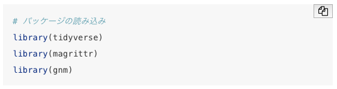

--- 
title: "『カテゴリカルデータの連関モデル』サポートページ"
author: "藤原翔（Sho Fujihara）"
date: "2022-04-25"
site: bookdown::bookdown_site
#output:
#  bookdown::gitbook: default
documentclass: book
bibliography: [book.bib, packages.bib]
biblio-style: apalike
link-citations: yes
---

## 目的 {-}

このページはRaymond Wong著・藤原翔訳．2021．『カテゴリカルデータの連関分析』共立出版．のためのサポートページです．本書の付録や補遺とすることも検討しましたが，*Association Models*は他のQASSに比べて分量が多いため，そしてRのバージョンアップやパッケージの更新などに備えるため，正誤表をできるだけ早く公開するためにオンラインで公開することにしました．本書と関連した情報についても，このサポートページで補うことができればと思います．

このサポートページでは，特にRの基本的な操作方法と，Rを用いた連関分析の方法を紹介します．各章ごとにRの実行方法をまとめています．モデルの意味や結果の解釈などについては本書を参考にしてください．

英語版のサポートページ https://studysites.sagepub.com/wongstudy/ が元になっていますので，そちらも参考にしてください．

## Rのスクリプト {-}

本サポートページのスクリプトはそのままコピー・アンド・ペーストすることが可能です．
スクリプトを選択してコピーしても良いですし，各スクリプトの右上の図をクリックしてもコピーされます．

なおRのスクリプトについては https://github.com/ShoFujihara/Association_Models の scripts というフォルダに保存されているので，そちらを参照してください．Googleドライブにもスクリプトを保存しておきます．https://drive.google.com/drive/folders/1oP0EURmoD8-dIkC6MCqDS3_0ysOz7t-0?usp=sharing

## サポートページバージョン情報 {-}

2022年4月25日

